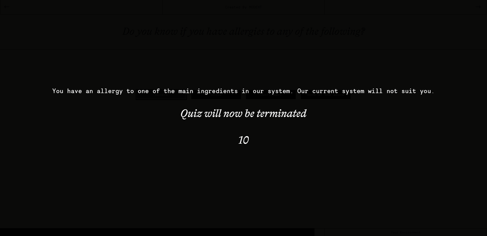

# This project is a toy project for training and quality assurance purposes

# Explain project

Admin login

localhost:3001/admin/login

email: admin@manaknight.com

password: a123456

View the quiz on localhost:3001/quiz-test.html

### Quiz 1

Response page of question What would you like to be called?. 
Make the name appears centered inside of the jar gif. 
 

### Quiz 2

Each response page should be closed after a set amount of time using the time stored in variable called "closeResponseTimeoutCounter" 

### Quiz 3

We have multiple types of questions type 7 being "multiple select" 
You are required to find where it is handled 
Then make the button of each option call checkAllergie function that you will be implementing in the next quiz 
Then add an option at the end of all options that says None of the above and onclick it should call this function handleNoneOfTheAbove() 

### Quiz 4

implement a function that is called checkAllergie() 
pseudo steps of the function

- find a way to read the dataset values on the html button element that generated the click
- check if that previous value is either Banana, Olive or Sunflowers terminate the quiz
- Terminate the quiz in this manner:
  - the termination process need to display a message to the user with a faded black background that has a message and a counter that when it reachs 0 it redirect to /
  - ex: 
  - message and counter should be controlled from admin portal
  - create a terminate configuration table with the appropriate fields
  - create a tab in admin portal to edit these fields
  - create an api to get these configuration and use it here to construct the termination screen

### Quiz 5

immplement a functionality for a user to continue from where they stopped if they wish to do so.
